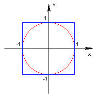
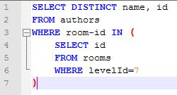

Тест
====

# SQL

```sql
-- Просто таблицы без внешних ключей

SET SCHEMA 'public';

DROP TABLE IF EXISTS employee;
DROP TABLE IF EXISTS department;

CREATE TABLE employee
(
  id            INT PRIMARY KEY NOT NULL,
  first_name    VARCHAR         NOT NULL,
  last_name     VARCHAR         NOT NULL,
  salary        INT             NOT NULL,
  department_id BIGINT
);

CREATE TABLE department
(
  id   INT PRIMARY KEY NOT NULL,
  name VARCHAR         NOT NULL
);

INSERT INTO department VALUES
  (1, 'IT'),
  (2, 'Marketing'),
  (3, 'Security');

INSERT INTO employee VALUES
  (1, 'Василий', 'Пупкин', 50000, 1),
  (2, 'Самсон', 'Улюкаев', 100000, 1),
  (3, 'Андрей', 'Квашин', 150000, 1),
  (4, 'Анна', 'Нонейм', 90000, 2),
  (5, 'Ксения', 'Хлам', 100000, 2);

-- 1. Список имён и фамилий всех сотрудников с названиями отделов, к которым каждый из них привязан

SELECT
  e.first_name,
  e.last_name,
  d.name
FROM employee e JOIN department d ON e.department_id = d.id;

-- 2. Список отделов с количеством сотрудников в каждом из них

SELECT
  d.name,
  count(e.id)
FROM employee e JOIN department d ON e.department_id = d.id
GROUP BY d.id;

-- 3. Список отделов, в которых нет сотрудников

SELECT d.name
FROM employee e RIGHT JOIN department d ON e.department_id = d.id
GROUP BY d.id
HAVING count(e.id) = 0;

-- 4. Список отделов, к которым привязано более двух сотрудников

SELECT d.name
FROM employee e JOIN department d ON e.department_id = d.id
GROUP BY d.id
HAVING count(e.id) > 2;

-- 5. Список отделов с указанием средней и максимальной зарплаты в каждом из них, отсортированный по убыванию средней зарплаты

SELECT
  d.name,
  COALESCE(avg(e.salary), 0) AS mean,
  COALESCE(max(e.salary), 0)
FROM employee e RIGHT JOIN department d ON e.department_id = d.id
GROUP BY d.id
ORDER BY mean DESC;
```

# Reversed TreeMap

```java
import java.util.Collections;
import java.util.TreeMap;

public class ReverseTreeMap {
    /*
     Как сделать так, чтобы в объекте TreeMap ключи, являющиеся числами,
     сортировались в обратном порядке (то есть при "сыром" выводе выводились
     в обратном порядке)? Напишите пример кода, кратко иллюстрирующий решение
     */
    public static void main(String[] args) {
        TreeMap<Number, Object> reversed = new TreeMap<>(Collections.reverseOrder());
        reversed.put(1, "Jupiter");
        reversed.put(2, "Saturn");
        reversed.put(3, "Neptune");
        reversed.put(4, "Uranus");
        reversed.put(5, "Earth");
        reversed.put(6, "Venus");
        reversed.put(7, "Mars");
        reversed.put(8, "Mercury");
        // expecting '{8=Mercury, 7=Mars, 6=Venus, 5=Earth, 4=Uranus, 3=Neptune, 2=Saturn, 1=Jupiter}'
        System.out.println("Solar System planets by mass: " + reversed);
    }
}
```

# Directories

```sql
-- Спроектируйте структуру SQL-таблицы для хранения дерева папок

SET SCHEMA 'public';

DROP TABLE IF EXISTS directory;

CREATE TABLE directory
(
  id          BIGINT  NOT NULL,
  parent_id   BIGINT  NOT NULL,
  name        VARCHAR NOT NULL,
  owner       VARCHAR NOT NULL,
  permissions BIT(9)  NOT NULL, -- rwxrwxrwx
  PRIMARY KEY (id),
  FOREIGN KEY (parent_id) REFERENCES directory (id)
);

CREATE UNIQUE INDEX directory_parent_id_and_name_idx ON directory (parent_id, name);

INSERT INTO directory VALUES
  (1, 1, 'root', 'system', B'111100100'),
  (2, 1, 'work', 'albert', B'111111100'),
  (3, 1, 'physics', 'albert', B'111100100'),
  (4, 2, 'math', 'mileva', B'111111111'),
  (5, 2, 'porn', 'albert', B'111111100'),
  (6, 1, 'kitties', 'mileva', B'111111100');
```

# Scrum vs. Kanban

Теперь по теме текущего вопроса. Скрам ориентирован на подробную декомпозицию задач и их скоростное выполнение в рамках непродолжительных спринтов (я использую итерации в 2 недели). В зависимости от проекта спринты могут быть распланированы на месяцы вперёд (когда имеем дело с направленной разработкой), либо это могут быть стихийные спринты, когда в работу берутся в первую очередь приоритетные задачи (доработки и интеграции на проектах, связанных с реализацией горящих хотелок бизнеса, например). При подобном подходе довольно непросто проталкивать в работу задачи системного характера, направленные на улучшение стабильности, быстродействия и удобства разработки для непосредственно разработчиков, если показатели качества работы для представителей бизнеса основываются на количестве заключённых сделок, например.

В канбане упор делается на качество исполнения задач. Задачи крупнее и не всегда могут быть оценены верно. Для каждого типа задач определена своя последовательность выполнения, в общем случае это стадии дизайна, разработки, тестирования и деплоймента. Каждая из стадий имеет ограничение на одновременное количество задач в работе. Управление проектом заключается в пополнении пулов задач для разных команд и их приоритезации. Есть также пул срочных задач, но их одновременное количество также должно быть ограничено, чтобы этим окном нельзя было значительно злоупотреблять в ущерб регулярной активности разработчиков.

# Microservices

> У Вас имеется большое веб-приложение (интернет-магазин), все компоненты которого используют одну и ту же базу данных. Поставлена задача выделить из него несколько сервисов с целью упрощения их поддержки - организовать SOA. Примеры сервисов:
> 
> * Сервис расчёта рекомендуемых цен на товары (на входе - ID товаров, на выходе - цены)
> * Сервис подбора похожих товаров (на входе - ID основного товара, на выходе - ID похожих)
> * Сервис сбора и анализа ошибок различного уровня
> 
> У Вас есть выбор между следующими архитектурными решениями по взаимодействию между сервисами:
> 
> * REST
> * AMQP
> * SOAP (XML)
> 
> Чем Вы будете руководствоваться при выборе решений?
> 
> Сравните данные решение и опишите их плюсы и минусы.

Пользователь (`user`) заходит на одну из страниц сайта (`facade`). На странице есть первостепенное содержимое, которое отдаётся синхронно, и второстепенное содержимое от сервисов предсказания цен (`price-predictor`) и рекомендаций (`similarity-predictor`), которое отдаётся асинхронно. Все проблемы рапортуются коллектору ошибок (`issue-collector`).

Сервисы `price-predictor` и `similarity-predictor` абсолютно идентичны снаружи. Запросы к ним могут выглядеть как

```http
GET {price-predictor}/predict/{id}
```

и

```http
GET {similarity-predictor}/predict/{id}
```

соответственно. При получении таких запросов любой из сервисов создаёт событие (event) вида

```json
{"id": UUID, "type": "PREDICT", "body": {"productId": ..., ...}}
```

и помещает его на соответствующую очередь AMQP, а также регистрирует статус этого события как NEW в неком перманентном распределённом (или не очень) кэше. Событиям, очевидно, нужно также назначать некоторое время жизни. После этого потребителю сервиса (в нашем случае это facade) возвращается код ответа 200 и идентификатор события. После этого фасад может по таймеру интересоваться состоянием обработки события:

```http
GET {price-predictor|similarity-predictor}/events/{id}
```

Отвечать можно http-статусами:
- 200 + результат обработки события
- 404 (событие не найдено или протухло, следует создать новое)
- 5xx (внутренняя ошибка сервиса, следует повторить запрос через некоторое время, используя, скажем экспоненциальное затухание)

Ошибки, возникающие в процессе работы всех подсистем должны регистрироваться через сервис issue-collector. Это тоже можно делать асинхронно:

```http
POST {issue-collector}/report/[warn|error]
```

В теле запроса передаётся описание проблемы согласно некоторому контракту, issue-collector эту ошибку помещает в очередь AMQP и отвечает http-статусом. Далее потребители, разбирающие очередь с ошибками, добираются до данной проблемы и выполняют контекстноспецифичные действия (шлют письма, смски, регистрируют уровни тревожности в подсистемах мониторинга и т.п.).

Минусов я особых не вижу, зато сплошные плюсы:
- слабая связанность (падение сервисов предсказаний не обрушивает фасад)
- высокая доступность (тяжёлые запросы выполняются асинхронно)
- простота масштабирования (можно легко плодить экземпляры серверов)

Можно, конечно, отнести к минусам увеличение числа подвижных деталей (AMQP и распределённый кэш), но при прямых руках всё сложится хорошо.

SOAP мне не нравится, из его достоинств только возможность подписывать любой фрагмент XML (что в демилитаризованной зоне не так уж и существенно) и удобство портирования схемы в wsdl. Я сторонник более лаконичных протоколов на основе JSON.


# PI

> Дана окружность, вписанная в квадрат, с радиусом, равным 1, и центром в точке 0 (в начале координат):
> 
> 
> 
> Площадь окружности вычисляется по формуле πr2, а площадь описанного вокруг неё квадрата равняется 4r2. Если случайным образом генерировать точки на плоскости, то отношение количества точек, попавших внутрь окружности (уравнение окружности: x2 + y2 = r2), к количеству точек, попавших в квадрат, будет стремиться отношению площадей данных фигур, из которого можно легко вычислить число «пи». Необходимо написать код, генерирующий число «пи».

```java
public class PI {
    public static void main(String[] args) {
        int iterations = Integer.parseInt(args[0]);
        double r = Double.parseDouble(args[1]);
        double epsilon = Double.parseDouble(args[2]);
        System.out.printf("pi = " + pi(iterations, r, epsilon));
    }

    public static double pi(int iterations, double r, double epsilon) {
        int circled = 0;
        int i = 0;
        while (i < iterations) {
            double x = random(-r, r);
            double y = random(-r, r);
            if (x * x + y * y - r * r < epsilon) {
                ++circled;
            }
            ++i;
        }
        return 4.0 * circled / iterations;
    }

    private static double random(double from, double to) {
        return Math.random() * (to - from) - to;
    }
}
```

# Almost Singleton

Этот кусок кода явно мечтает стать сингтоном, я ему помогу:

```java
public class PriceComparator {
    private static final PriceComparator INSTANCE = new PriceComparator();

    public static PriceComparator getInstance() {
        return INSTANCE;
    }

    private PriceComparator() { }
}
```

В оригинальном фрагменте нарушены правила кодирования, поскольку капсом принято писать только статические константы. Ну и в целом такая реализация не имеет смысла: нестатический доступ к экземпляру в методе GetInstance, сам экземпляр нестатический, ну и не в конструкторе ж инициализировать одиночку.

# Spaghetti

Код являет собой лапшу из условий, он не скомпилируется (метод createDevice ничего не возвращает, хоть и должен). Написание наследника под каждый тип и цвет тоже имеет мало смысла. При переписывании я бы не ограничился одним классом, но так-то пусть будет что-то вроде словаря с фабриками:

```java
import java.util.HashMap;
import java.util.Map;

public class AppleDeviceStore {
    public static class UnsupportedAppleDeviceException extends Exception {
        private static final String MESSAGE = "Unsupported apple device (type=%s, color=%s)";

        public UnsupportedAppleDeviceException(String type, String color) {
            super(String.format(MESSAGE, type, color));
        }
    }

    private interface AppleDeviceFactory {
        AppleDevice createDevice();
    }

    private static final Map<String, Map<String, AppleDeviceFactory>> FACTORIES = new HashMap<>();

    {
        Map<String, AppleDeviceFactory> iPhoneFactories = FACTORIES.put("iPhone", new HashMap<>());
        iPhoneFactories.put("white", WhiteIPhone::new);
        iPhoneFactories.put("black", BlackIPhone::new);
        iPhoneFactories.put("gold", GoldIPhone::new);

        Map<String, AppleDeviceFactory> iPadFactories = FACTORIES.put("iPad", new HashMap<>());
        iPadFactories.put("white", WhiteIPad::new);
        iPadFactories.put("black", BlackIPad::new);
        iPadFactories.put("gold", GoldIPad::new);

        Map<String, AppleDeviceFactory> iPodFactories = FACTORIES.put("iPod", new HashMap<>());
        iPodFactories.put("white", WhiteIPod::new);
        iPodFactories.put("black", BlackIPod::new);
        iPodFactories.put("gold", GoldIPod::new);
    }

    public AppleDevice createDevice(String type, String color) throws UnsupportedAppleDeviceException {
        Map<String, AppleDeviceFactory> factories = FACTORIES.get(type);
        if (factories == null) {
            throw new UnsupportedAppleDeviceException(type, color);
        }
        AppleDeviceFactory factory = factories.get(color);
        if (factory == null) {
            throw new UnsupportedAppleDeviceException(type, color);
        }

        AppleDevice device = factory.createDevice();
        device.verifyPrice();
        device.calculateDeliveryPrice();
        device.reserveItem();
        device.sendNotification();
        device.sendToCustomer();
        return device;
    }
}
```

Я изменил сигнатуру основного метода, но можно и не менять, если сменить тип исключения на RuntimeException.

# Abstract Classes and Interfaces

```java
public class Operators {
    interface BinaryOperator {
        boolean apply(boolean x, boolean y);
    }

    abstract static class AbstractBinaryOperator implements BinaryOperator {
        private final BinaryOperator impl;

        protected AbstractBinaryOperator(BinaryOperator impl) {
            this.impl = impl;
        }

        @Override
        public boolean apply(boolean x, boolean y) {
            return impl.apply(x, y);
        }
    }

    static class AND extends AbstractBinaryOperator {
        public AND() {
            super((x, y) -> x && y);
        }
    }

    static class OR extends AbstractBinaryOperator {
        public OR() {
            super((x, y) -> x || y);
        }
    }

    static class XOR extends AbstractBinaryOperator {
        public XOR() {
            super((x, y) -> x ^ y);
        }
    }

    public static void main(String[] args) {
        System.out.println("true AND true -> " + new AND().apply(true, true)); // true
        System.out.println("false OR true -> " + new OR().apply(false, true)); // false
        System.out.println("true XOR false -> " + new XOR().apply(true, false)); // true
    }
}
```

# R2D2

> Взгляните на SQL-запрос:
> 
> 
> 
> Есть ли в нём какие-то проблемы? Если да, то какие и как их исправить? Напишите новый запрос, в котором не будет данных проблем.
 
```sql
-- Просто таблицы без внешних ключей

SET SCHEMA 'public';

DROP TABLE IF EXISTS rooms;
DROP TABLE IF EXISTS authors;

CREATE TABLE rooms
(
  id      VARCHAR PRIMARY KEY NOT NULL,
  levelId INT                 NOT NULL
);

CREATE TABLE authors
(
  id        VARCHAR PRIMARY KEY NOT NULL,
  name      VARCHAR             NOT NULL,
  "room-id" VARCHAR             NOT NULL
);

INSERT INTO rooms VALUES
  ('it', 7),
  ('marketing', 3),
  ('security', 1);

INSERT INTO authors VALUES
  ('vpupkin', 'Василий Пупкин', 'it'),
  ('sulukaev', 'Самсон Улюкаев', 'it'),
  ('akvashin', 'Андрей Квашин', 'it'),
  ('anoname', 'Анна Нонейм', 'marketing'),
  ('kchlam', 'Ксения Хлам', 'marketing'),
  ('r2d2', 'R2D2', 'security');
```

Запрос из условия задачи выбирает уникальные сочетания `authors.name`+`authors.id`, что лишено смысла, если предположить, что поле `authors.id` уникально само по себе.
  
Допустим, по оригинальной задумке выбирались уникальные авторы на седьмом этаже. И для большей наглядности я перепишу оригинальный запрос:

```sql
SELECT
  a.name,
  a.id
FROM authors a JOIN rooms r ON a."room-id" = r.id
WHERE r.levelId = 7;
```

Но я пойду дальше и помещу ещё по одному роботу R2D2 на каждый из оставшихся этажей, причём роботы будут обёединены в единую сеть:

```sql
SET SCHEMA 'public';

DROP TABLE IF EXISTS room_autor;
DROP TABLE IF EXISTS room;
DROP TABLE IF EXISTS author;

CREATE TABLE room
(
  id    VARCHAR PRIMARY KEY NOT NULL,
  level INT                 NOT NULL
);

CREATE TABLE author
(
  id   VARCHAR PRIMARY KEY NOT NULL,
  name VARCHAR             NOT NULL
);

CREATE TABLE room_autor
(
  room_id   VARCHAR NOT NULL,
  author_id VARCHAR NOT NULL,
  PRIMARY KEY (room_id, author_id),
  FOREIGN KEY (room_id) REFERENCES room (id),
  FOREIGN KEY (author_id) REFERENCES author (id)
);

INSERT INTO room VALUES
  ('it', 7),
  ('marketing', 3),
  ('security', 1);

INSERT INTO author VALUES
  ('vpupkin', 'Василий Пупкин'),
  ('sulukaev', 'Самсон Улюкаев'),
  ('akvashin', 'Андрей Квашин'),
  ('anoname', 'Анна Нонейм'),
  ('kchlam', 'Ксения Хлам'),
  ('r2d2', 'R2D2');

INSERT INTO room_autor VALUES
  ('it', 'vpupkin'),
  ('it', 'sulukaev'),
  ('it', 'akvashin'),
  ('marketing', 'anoname'),
  ('marketing', 'kchlam'),
  ('it', 'r2d2'),
  ('marketing', 'r2d2'),
  ('security', 'r2d2');
```

Тогда оригинальный запрос станет выглядеть следующим образом:

```sql
SELECT
  a.id,
  a.name
FROM author a
  JOIN room_autor ra ON a.id = ra.author_id
  JOIN room r ON ra.room_id = r.id
WHERE r.level = 7;
```

# POS

> Согласно спецификации сервер должен возвращать список торговых точек (POS = Point Of Sale, магазинов) в следующем формате:
> 
> ```json
> {
>     "result":BOOLEAN, - результат выполнения запроса
>     "count":INT, - общее количество торговых точек по данному запросу без учёта "offset" и "count" 
>     "pos":[
>         {
>             "id":INT,
>             "latitude":FLOAT,
>             "longitude":FLOAT,
>             "companyIds":[INT], - идентификаторы компаний (например, "Ашан", "Перекрёсток")
>             "address":STRING,
>             "workTime":{ - время работы торговой точки
>                 "Mon":[ - массив времени работы в данный день недели; если пустой - круглосуточно, если день отсутствует - выходной
>                     ["09:00","13:00"],
>                     ["14:00","19:00"],
>                     ...
>                 ],
>                 "Fri":[
>                     ["10:00","13:30"],
>                     ["15:00","17:30"],
>                     ...
>                 ],
>                 ...
>             },
>             "contacts":[ - контакты торговой точки
>                 {
>                     "type":STRING, - URL, PHONE, E_MAIL
>                     "value":STRING,
>                     "name":STRING|NULL
>                 },
>                 ...
>             ],
>         },
>         ...
>     ]
> }
> ```
>
> Пожалуйста, спроектируйте, структуру SQL-таблиц для хранения этих данных с указанием типов каждого поля.

```sql
DROP TABLE IF EXISTS pos_business_hours;
DROP TABLE IF EXISTS pos_company;
DROP TABLE IF EXISTS pos_contact;
DROP TABLE IF EXISTS pos;
DROP TABLE IF EXISTS company;

DROP TYPE IF EXISTS DAY_OF_WEEK;
DROP TYPE IF EXISTS CONTACT_TYPE;

CREATE TYPE DAY_OF_WEEK AS ENUM ('Mon', 'Tue', 'Wed', 'Thu', 'Fri', 'Sat', 'Sun');
CREATE TYPE CONTACT_TYPE AS ENUM ('URL', 'PHONE', 'E_MAIL');

CREATE TABLE pos
(
  id        INT PRIMARY KEY NOT NULL,
  latitude  FLOAT           NOT NULL,
  longitude FLOAT           NOT NULL,
  address   VARCHAR         NOT NULL
);

CREATE TABLE company
(
  id   INT PRIMARY KEY NOT NULL,
  name VARCHAR         NOT NULL
);

CREATE TABLE pos_company
(
  pos_id     INT NOT NULL,
  company_id INT NOT NULL,
  PRIMARY KEY (pos_id, company_id),
  FOREIGN KEY (pos_id) REFERENCES pos (id),
  FOREIGN KEY (company_id) REFERENCES company (id)
);

CREATE TABLE pos_business_hours
(
  pos_id      INT         NOT NULL,
  day_of_week DAY_OF_WEEK NOT NULL,
  open        TIME        NOT NULL,
  close       TIME        NOT NULL,
  PRIMARY KEY (pos_id, day_of_week),
  FOREIGN KEY (pos_id) REFERENCES pos (id)
);

CREATE TABLE pos_contact
(
  pos_id INT          NOT NULL,
  type   CONTACT_TYPE NOT NULL,
  value  VARCHAR      NOT NULL,
  name   VARCHAR      NOT NULL,
  FOREIGN KEY (pos_id) REFERENCES pos (id)
);
```
