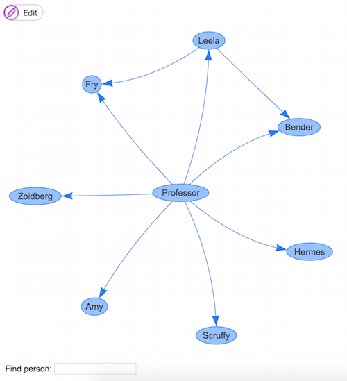

# Test task

Build an application with possibility to visualize employee structure hierarchy and manage using web technologies.

**Non functional requirements:**

Application should be built using in back-end one of programming languages, which is running in JVM (e.g. Java, Scala, Kotlin etc). Front-end should be built using ECMAScript 6 and in functional style. Datastore for structure model should be designed and decided should be decided by candidate. Application should be covered with tests and building procedure should be added into project as README.MD

**Functional requirements:**

As a user I would like to have such options in web application:

1. View hierarchical structure in visual way. With showing all employees.
2. I would like to search in visual structure by name and highlight found persons.
3. Add into hierarchy new people with possibility to search existing employees in hierarchy and add under found employee newly added employee.
4. Delete in hierarchy employee without breaking structure.

**NB!!!** Additional challenge (optional)
As a user I would like to have another visual structure with the same employees, but with possibility to show another details. “Who can sign important documents in hierarchy.”

**PS!!!** Employee can have more than one manager and one person in structure won’t have top managers (CEO).

**Presenting finished task:**

1. Generate sample data.
2. Working solution should be presented on local machine.
3. Publish code in Github or BitBucket and share link.
4. (Optional) Deploy solution in free cloud to demo (Amazon AWS , Azure)

## Solution

The first section of our API will be about employees management:

- method `GET /api/dev/employees` lists all employees
- method `PUT /api/dev/employees/{id}` creates employee and specify his properties
- method `POST /api/dev/employees/{id}` allows us to update employee's properties
- method `DELETE /api/dev/employees/{id}` removes employee

No let's define some endpoints to handle manager-to-employee relations:

- method `GET /api/dev/managers` lists all managers
- method `PUT /api/dev/managers/{id}/employees/{employeeId}` allows us to make a relation between manager and employee
- method `DELETE /api/dev/managers/{id}/employees/{employeeId}` removes relation between manager and employee

To start just run maven goal:

```
mvn spring-boot run
```

Now check out the tool for visual editing at `localhost:11177`. You should see something like this:



Try to press `Edit` and perform some actions or try to find and highlight person with text field at left bottom corner.
